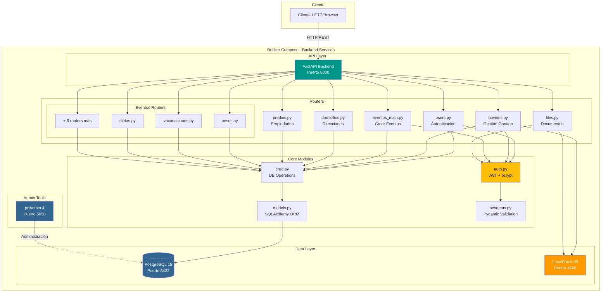
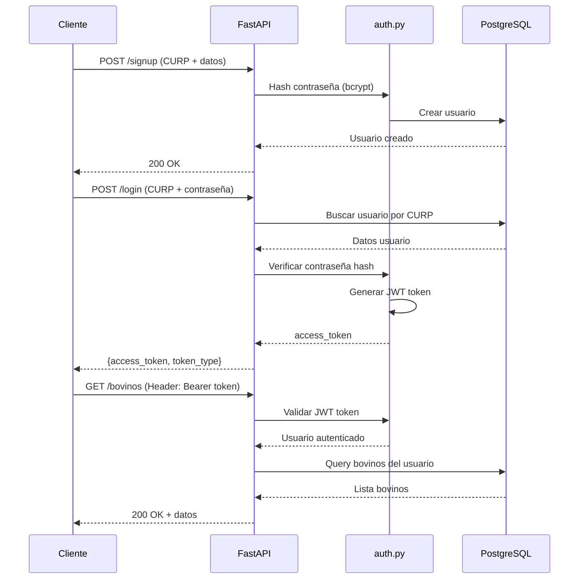
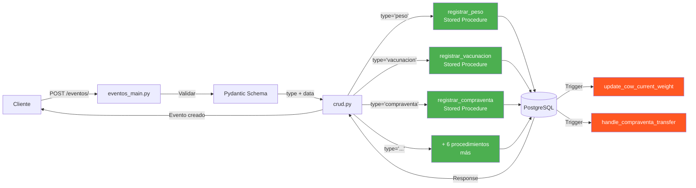
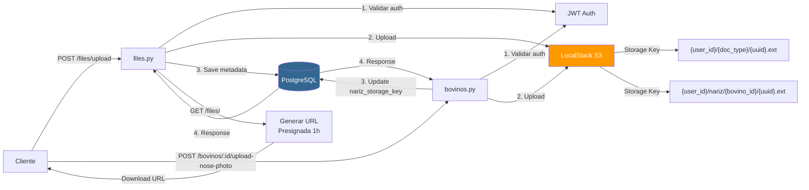
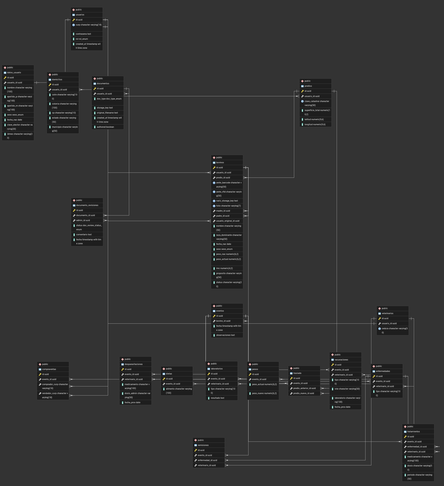

# API Backend - Unión Ganadera

Sistema backend para la gestión del sistema de Unión Ganadera. Esta API está construida con FastAPI y proporciona endpoints RESTful para la administración de usuarios, ganado bovino, eventos y documentos.

## 🔗 Repositorios

Este proyecto es parte de un ecosistema más grande. Revisa los otros repositorios de sus componentes:

- **Flutter App**: [union_ganadera_app](https://github.com/jorgemp1270/union_ganadera_app)

## 📋 Descripción del Proyecto

Este proyecto es un sistema completo de gestión ganadera que permite a los usuarios registrar y gestionar su ganado bovino, realizar seguimiento de eventos (vacunaciones, pesajes, tratamientos, etc.), administrar documentos y realizar transacciones de compra-venta. El sistema cuenta con autenticación JWT, almacenamiento de archivos en S3, y una arquitectura basada en microservicios con Docker.

## 🚀 Tecnologías Utilizadas

- **Framework:** FastAPI (Python)
- **Base de Datos:** PostgreSQL 15
- **Almacenamiento de Objetos:** LocalStack (emulación de AWS S3)
- **Contenedorización:** Docker & Docker Compose
- **ORM:** SQLAlchemy
- **Autenticación:** JWT (JSON Web Tokens)
- **Administración de BD:** pgAdmin 4

## 🏗️ Arquitectura del Sistema

### Arquitectura de Microservicios



### Flujo de Autenticación



### Flujo de Eventos (Sistema de Eventos Dinámico)



### Almacenamiento de Archivos (S3)



### Esquema de Base de Datos

<p align="center">
  
</p>

El esquema completo incluye:
- **Tablas principales:** usuarios, bovinos, eventos, documentos, domicilios, predios
- **Tablas de eventos:** pesos, dietas, vacunaciones, desparasitaciones, laboratorios, compraventas, traslados, enfermedades, tratamientos
- **Stored Procedures:** 9 procedimientos para registro de eventos
- **Triggers:** Actualización automática de peso y transferencia de propiedad en compraventas
- **Constraints:** Foreign keys, unique constraints, y validaciones

## 📦 Requisitos Previos

Antes de comenzar, asegúrate de tener instalado:

- [Docker](https://www.docker.com/) (versión 20.10 o superior)
- [Docker Compose](https://docs.docker.com/compose/) (versión 2.0 o superior)
- Git

## 🔧 Configuración e Instalación

### 1. Clonar el Repositorio

```bash
git clone <repository-url>
cd union_ganadera/backend_api
```

### 2. Variables de Entorno

El proyecto incluye un archivo `.env` con la configuración predeterminada para desarrollo local. Puedes modificarlo según tus necesidades:

```env
# Base de datos
POSTGRES_USER=postgres
POSTGRES_PASSWORD=postgres
POSTGRES_DB=union_ganadera

# JWT
SECRET_KEY=your-secret-key-here
ALGORITHM=HS256

# LocalStack S3
AWS_ACCESS_KEY_ID=test
AWS_SECRET_ACCESS_KEY=test
S3_BUCKET_NAME=documentos
S3_ENDPOINT_URL=http://localstack:4566
```

### 3. Construir y Ejecutar con Docker

Ejecuta el siguiente comando para construir e iniciar todos los servicios:

```bash
docker-compose up --build
```

Para ejecutar en segundo plano (modo detached):

```bash
docker-compose up --build -d
```

Este comando iniciará los siguientes servicios:

| Servicio | Puerto | Descripción |
|----------|--------|-------------|
| **Backend API** | 8000 | Aplicación FastAPI |
| **PostgreSQL** | 5432 | Base de datos |
| **LocalStack S3** | 4566 | Almacenamiento de archivos |
| **pgAdmin** | 5050 | Interfaz de administración de BD |

### 4. Verificar la Instalación

Una vez que los contenedores estén ejecutándose, verifica que todo funcione correctamente:

- **API Documentación (Swagger UI):** [http://localhost:8000/docs](http://localhost:8000/docs)
- **API Documentación (ReDoc):** [http://localhost:8000/redoc](http://localhost:8000/redoc)
- **pgAdmin:** [http://localhost:5050](http://localhost:5050)

### 5. Configurar pgAdmin (Opcional)

Para administrar la base de datos mediante pgAdmin:

1. Abre [http://localhost:5050](http://localhost:5050)
2. Inicia sesión con:
   - **Email:** `admin@admin.com`
   - **Password:** `admin`
3. Agrega una nueva conexión al servidor:
   - **Name:** `Union Ganadera DB`
   - **Host:** `db` (usar el nombre del contenedor, no localhost)
   - **Port:** `5432`
   - **Username:** `postgres`
   - **Password:** `postgres`
   - **Database:** `union_ganadera`

### 6. Detener los Servicios

Para detener todos los contenedores:

```bash
docker-compose down
```

Para detener y eliminar volúmenes (⚠️ esto borrará los datos):

```bash
docker-compose down -v
```

## ✨ Características Principales

### Seguridad
- **Protección contra Inyección SQL:** Uso de consultas parametrizadas y procedimientos almacenados
- **Autenticación:** JWT con contraseñas hasheadas usando bcrypt
- **Autorización:** Verificación de propiedad de recursos antes de modificaciones
- **CORS:** Configuración de políticas de origen cruzado

### Gestión de Usuarios
- Registro de usuarios con validación de CURP
- Login con generación de tokens JWT
- Roles de usuario (usuario, veterinario, admin)

### Gestión de Ganado (Bovinos)
- CRUD completo de registros de ganado
- Identificación con arete (código de barras y RFID)
- Nombre personalizado para cada animal
- Fotografía de nariz para identificación biométrica (almacenada en S3)
- Seguimiento de peso, raza, propósito y estado
- Relaciones de parentesco (padre/madre)
- Registro de propietario original (usuario_original_id)
- Asignación a predios específicos

### Sistema de Eventos
Motor de eventos dinámico con llamadas a procedimientos almacenados para:
- **Pesos:** Registro de pesaje (actualiza automáticamente el peso actual)
- **Vacunaciones:** Control de vacunas con fechas de próxima aplicación
- **Dietas:** Cambios en la alimentación
- **Desparasitaciones:** Control de desparasitantes
- **Laboratorios:** Resultados de análisis clínicos
- **Compraventas:** Transferencia automática de propiedad usando CURP
- **Traslados:** Cambios de ubicación entre predios
- **Enfermedades:** Registro de diagnósticos
- **Tratamientos:** Medicamentos y procedimientos

### Gestión de Ubicaciones
- **Domicilios:** Direcciones de los usuarios
- **Predios:** Propiedades con coordenadas GPS y clave catastral

### Almacenamiento de Documentos
- Carga de documentos a S3
- URLs prefirmadas con validez de 1 hora
- Tipos: identificación, comprobante de domicilio, documentos de predio, cédula veterinaria
- Estado de autorización por administradores

### Almacenamiento de Documentos
- Carga de documentos a S3
- URLs prefirmadas con validez de 1 hora
- Tipos: identificación, comprobante de domicilio, documentos de predio, cédula veterinaria
- Estado de autorización por administradores

## 📚 Guía de Uso de la API

### Autenticación

**1. Registrar un nuevo usuario**

`POST /signup`

```json
{
  "curp": "DOEJ900515HDFRHN01",
  "contrasena": "MiPassword123!",
  "nombre": "Juan",
  "apellido_p": "Pérez",
  "apellido_m": "García",
  "sexo": "M",
  "fecha_nac": "1990-05-15",
  "clave_elector": "PRGAJN900515H",
  "idmex": "1234567890123"
}
```

**2. Iniciar sesión**

`POST /login`

```json
{
  "curp": "DOEJ900515HDFRHN01",
  "contrasena": "MiPassword123!"
}
}
```

*Retorna un `access_token`. Incluye este token en el header `Authorization` como `Bearer <token>` para todos los endpoints protegidos.*

### Gestión de Ganado

**Listar tu ganado**

`GET /bovinos/?skip=0&limit=100`

**Registrar un nuevo animal**

`POST /bovinos/`

```json
{
  "nombre": "Torito",
  "arete_barcode": "MX123456",
  "arete_rfid": "RFID001122",
  "madre_id": "uuid-madre",
  "padre_id": "uuid-padre",
  "predio_id": "uuid-predio",
  "raza_dominante": "Angus",
  "sexo": "M",
  "peso_nac": 35.5,
  "peso_actual": 450.0,
  "fecha_nac": "2023-03-15",
  "proposito": "Engorda"
}
```

**Campos Automáticos:**
- `usuario_id`: Se establece automáticamente al usuario autenticado
- `usuario_original_id`: Se establece automáticamente al usuario que registra el bovino y **nunca cambia**, incluso si el bovino es vendido
- Estos campos NO deben incluirse en el cuerpo de la petición

*Nota: Todos los demás campos son opcionales.*

**Actualizar información de un animal**

`PUT /bovinos/{bovino_id}`

```json
{
  "nombre": "Torito Jr.",
  "peso_actual": 475.5,
  "proposito": "Reproducción"
}
```

**Campos Protegidos (NO se pueden actualizar via PUT):**
- `usuario_id` - Solo cambia mediante eventos de compraventa (trigger de base de datos)
- `usuario_original_id` - Inmutable, nunca cambia
- `nariz_storage_key` - Solo se actualiza mediante `POST /bovinos/{id}/upload-nose-photo`
- `id`, `status` - Campos gestionados por el sistema

**Subir foto de nariz**

`POST /bovinos/{bovino_id}/upload-nose-photo`

- **Content-Type:** `multipart/form-data`
- **Parámetro:** `file` - Archivo de imagen (JPG, PNG, etc.)

La foto se almacena en: `{user_id}/nariz/{bovino_id}/{uuid}.{extension}`

**Actualizar datos del animal**

`PUT /bovinos/{id}`

```json
{
  "nombre": "Torito Jr.",
  "peso_actual": 450.5
}
```

### Crear Eventos

**Ejemplo: Registrar Peso**

`POST /eventos/`

```json
{
  "type": "peso",
  "data": {
    "bovino_id": "uuid-del-bovino",
    "peso_nuevo": 500.5,
    "observaciones": "Control mensual"
  }
}
```

**Ejemplo: Registrar Vacunación**

`POST /eventos/`

```json
{
  "type": "vacunacion",
  "data": {
    "bovino_id": "uuid-del-bovino",
    "veterinario_id": "uuid-veterinario",
    "tipo": "Fiebre Aftosa",
    "lote": "LOTE2024-001",
    "laboratorio": "Zoetis",
    "fecha_prox": "2027-01-24"
  }
}
```

**Ejemplo: Registrar Compraventa**

`POST /eventos/`

```json
{
  "type": "compraventa",
  "data": {
    "bovino_id": "uuid-del-bovino",
    "comprador_curp": "DOEJ900515HDFRHN01",
    "vendedor_curp": "SMIJ850320MDFRHN02",
    "observaciones": "Venta acordada"
  }
}
```

### Consultar Eventos Detallados

Cada tipo de evento tiene endpoints dedicados para consultar información detallada:

- **Pesos:** `GET /eventos/pesos/`
- **Vacunaciones:** `GET /eventos/vacunaciones/`
- **Dietas:** `GET /eventos/dietas/`
- **Desparasitaciones:** `GET /eventos/desparasitaciones/`
- **Laboratorios:** `GET /eventos/laboratorios/`
- **Compraventas:** `GET /eventos/compraventas/`
- **Traslados:** `GET /eventos/traslados/`
- **Enfermedades:** `GET /eventos/enfermedades/`
- **Tratamientos:** `GET /eventos/tratamientos/`

También puedes filtrar por bovino: `GET /eventos/pesos/bovino/{bovino_id}`

### Gestión de Documentos

**Subir un archivo**

`POST /files/upload`

- **Content-Type:** `multipart/form-data`
- **Parámetros:**
  - `file`: Archivo a subir (PDF, imagen, etc.)
  - `doc_type`: Tipo de documento (`identificacion`, `comprobante_domicilio`, `predio`, `cedula_veterinario`, `otro`)

**Listar documentos**

`GET /files/?skip=0&limit=100`

Retorna lista de documentos con URLs prefirmadas válidas por 1 hora.

## 🗂️ Estructura del Proyecto

```
backend_api/
├── app/
│   ├── main.py                 # Punto de entrada de la aplicación
│   ├── database.py             # Configuración de la base de datos
│   ├── models.py               # Modelos SQLAlchemy
│   ├── schemas.py              # Esquemas Pydantic
│   ├── auth.py                 # Lógica de autenticación
│   ├── crud.py                 # Operaciones CRUD
│   └── routers/                # Endpoints de la API
│       ├── users.py            # Autenticación y usuarios
│       ├── bovinos.py          # Gestión de ganado
│       ├── eventos_main.py     # Creación de eventos
│       ├── files.py            # Carga de archivos
│       ├── domicilios.py       # Direcciones
│       ├── predios.py          # Propiedades
│       └── eventos/            # Consulta de eventos por tipo
│           ├── pesos.py
│           ├── vacunaciones.py
│           ├── dietas.py
│           └── ...
├── db_schema.sql               # Esquema de base de datos
├── docker-compose.yml          # Configuración de Docker
├── Dockerfile                  # Imagen de Docker
├── requirements.txt            # Dependencias Python
├── .env                        # Variables de entorno
├── .gitignore                  # Archivos ignorados por Git
├── README.md                   # Este archivo
└── API_DOCUMENTATION.md        # Documentación detallada de la API
```

## 🔌 Endpoints Principales

| Método | Endpoint | Descripción |
|--------|----------|-------------|
| POST | `/signup` | Registrar nuevo usuario |
| POST | `/login` | Iniciar sesión |
| GET | `/users/me` | Obtener usuario actual |
| GET/POST/PUT/DELETE | `/bovinos/` | CRUD de ganado |
| POST | `/bovinos/{id}/upload-nose-photo` | Subir foto de nariz del bovino |
| POST | `/eventos/` | Crear evento |
| GET | `/eventos/{tipo}/` | Consultar eventos por tipo |
| POST | `/files/upload` | Subir documento |
| GET | `/files/` | Listar documentos |
| GET/POST/PUT/DELETE | `/domicilios/` | CRUD de direcciones |
| GET/POST/PUT/DELETE | `/predios/` | CRUD de propiedades |

Para documentación completa de la API, consulta:
- **Swagger UI:** [http://localhost:8000/docs](http://localhost:8000/docs)
- **ReDoc:** [http://localhost:8000/redoc](http://localhost:8000/redoc)
- **Documentación detallada:** [API_DOCUMENTATION.md](API_DOCUMENTATION.md)

## 🛠️ Desarrollo

### Ejecutar en modo desarrollo

```bash
# Iniciar servicios
docker-compose up

# Ver logs en tiempo real
docker-compose logs -f backend

# Reiniciar solo el backend
docker-compose restart backend

# Acceder al contenedor
docker exec -it union_ganadera_backend bash
```

### Ejecutar migraciones de base de datos

El esquema se inicializa automáticamente al arrancar el contenedor usando `db_schema.sql`. Para modificaciones:

1. Edita `db_schema.sql`
2. Elimina el volumen de la base de datos: `docker-compose down -v`
3. Reinicia los servicios: `docker-compose up --build`

---

**Nota:** Este proyecto usa LocalStack para emular AWS S3 en desarrollo. Para producción, configura credenciales reales de AWS S3.
