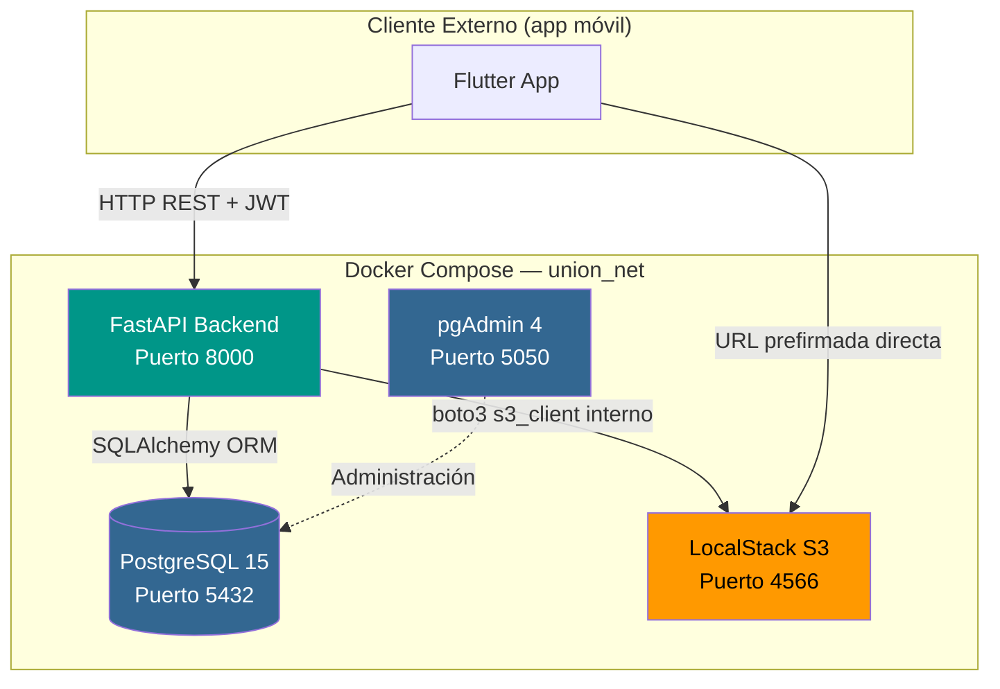
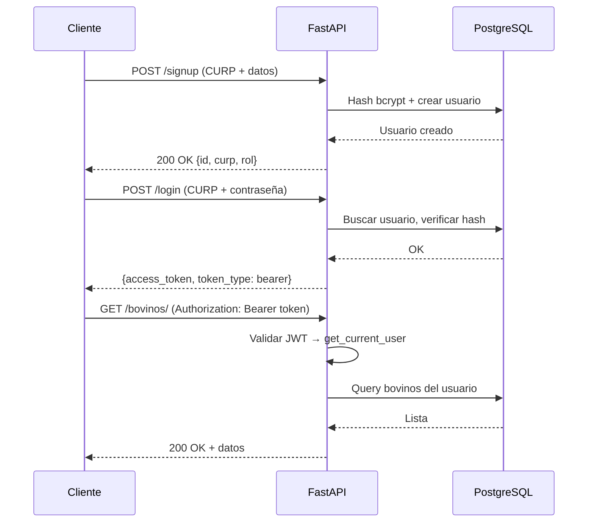
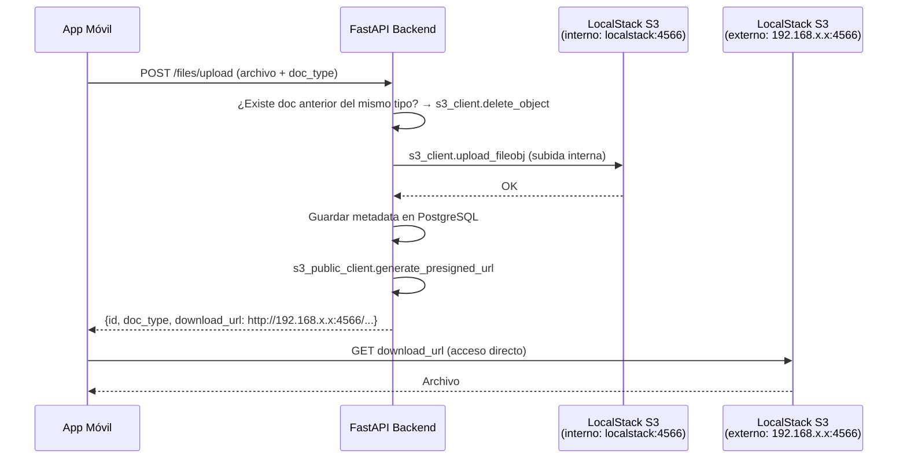
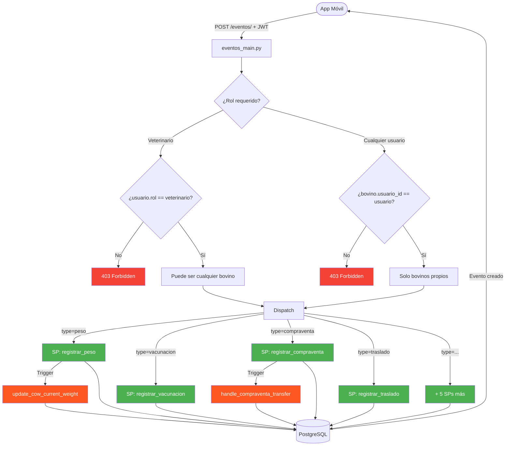
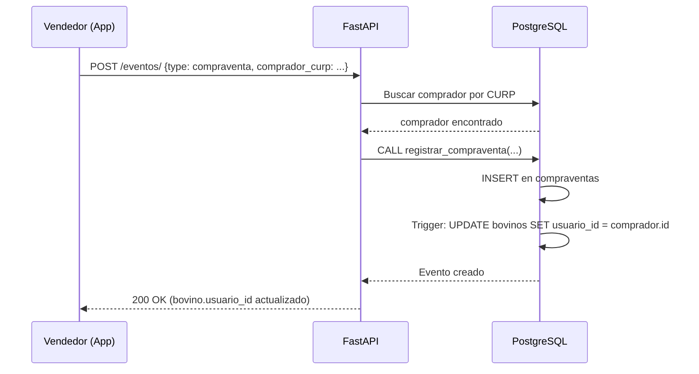

# API Backend — Unión Ganadera

Sistema backend para la gestión del sistema de Unión Ganadera. Construido con FastAPI, proporciona endpoints RESTful para la administración de usuarios, ganado bovino, predios, domicilios, eventos y documentos.

## 🔗 Repositorios Relacionados

- **Flutter App:** [union_ganadera_app](https://github.com/jorgemp1270/union_ganadera_app)

---

## 📋 Descripción

Sistema completo de gestión ganadera que permite:

- Registrar y administrar ganado bovino con seguimiento de propietario
- Gestionar predios y domicilios asociados a cada usuario
- Registrar eventos veterinarios y productivos (pesajes, vacunaciones, compraventas, etc.)
- Cargar y almacenar documentos en S3 con URLs prefirmadas para acceso externo
- Autenticación JWT con roles diferenciados (usuario, veterinario, admin)

---

## 🚀 Tecnologías

| Componente | Tecnología |
|---|---|
| Framework | FastAPI (Python 3.10) |
| Base de datos | PostgreSQL 15 |
| ORM | SQLAlchemy |
| Validación | Pydantic v2 |
| Autenticación | JWT + bcrypt |
| Almacenamiento | LocalStack S3 (emulación AWS) |
| Contenedorización | Docker & Docker Compose |
| Administración BD | pgAdmin 4 |

---

## 🏗️ Arquitectura

### Servicios Docker



### Módulos del Backend

```
app/
├── main.py              # Punto de entrada, registro de routers
├── auth.py              # JWT, bcrypt, dependencia get_current_user
├── crud.py              # Todas las operaciones con la base de datos
├── database.py          # Sesión SQLAlchemy, engine
├── models.py            # Modelos ORM (tablas, enums)
├── schemas.py           # Esquemas Pydantic (request/response)
├── s3.py                # Clientes S3: s3_client (interno) y s3_public_client (URLs externas)
└── routers/
    ├── users.py         # Registro, login, perfil
    ├── bovinos.py       # CRUD de bovinos, foto de nariz, búsqueda
    ├── domicilios.py    # CRUD de domicilios + carga de comprobante
    ├── predios.py       # CRUD de predios + carga de documento + bovinos por predio
    ├── files.py         # Listado, carga genérica y eliminación de documentos
    ├── eventos_main.py  # Creación de eventos (despacha a procedimientos almacenados)
    └── eventos/
        ├── pesos.py
        ├── vacunaciones.py
        ├── dietas.py
        ├── desparasitaciones.py
        ├── laboratorios.py
        ├── compraventas.py
        ├── traslados.py
        ├── enfermedades.py
        └── tratamientos.py
```

### Flujo de Autenticación



### Almacenamiento S3 — Clientes Dual

El módulo `app/s3.py` define dos clientes boto3:

| Cliente | Variable de entorno | Uso |
|---|---|---|
| `s3_client` | `S3_ENDPOINT_URL` (hostname Docker interno) | Subir y eliminar archivos desde el backend |
| `s3_public_client` | `S3_PUBLIC_URL` (IP/hostname alcanzable externamente) | Generar URLs prefirmadas para la app móvil |

Esto resuelve el problema de que las URLs prefirmadas embeben el hostname del cliente S3: si se usara `localstack:4566`, la app móvil no podría acceder. Con `S3_PUBLIC_URL=http://192.168.x.x:4566` las URLs son accesibles desde la red local.



### Patrones de Keys en S3

```
# Documentos genéricos (frente/reverso de INE, cedula vet, etc.)
{user_id}/{doc_type}/{uuid}.{ext}

# Comprobante de domicilio (uno por domicilio)
{user_id}/comprobante_domicilio/{domicilio_id}/{uuid}.{ext}

# Documento de predio (uno por predio)
{user_id}/predio/{predio_id}/{uuid}.{ext}

# Foto de nariz de bovino (una por bovino)
{user_id}/nariz/{bovino_id}/{uuid}.{ext}
```

### Esquema de Base de Datos

<p align="center">
  
</p>

- **Tablas principales:** usuarios, bovinos, documentos, domicilios, predios
- **Tablas de eventos:** pesos, dietas, vacunaciones, desparasitaciones, laboratorios, compraventas, traslados, enfermedades, tratamientos
- **Stored Procedures:** 9 procedimientos para registro de eventos
- **Triggers:** Actualización automática de peso y transferencia de propiedad en compraventas
- **Predios:** FK directa a `usuarios.id` (sin pasar por domicilio)

---

## 📦 Requisitos Previos

- [Docker](https://www.docker.com/) ≥ 20.10
- [Docker Compose](https://docs.docker.com/compose/) ≥ 2.0
- Git

---

## 🔧 Instalación y Configuración

### 1. Clonar el repositorio

```bash
git clone <repository-url>
cd union_ganadera/backend_api
```

### 2. Variables de entorno

Copia `.env_example` a `.env` y ajusta los valores:

```bash
cp .env_example .env
```

Contenido de referencia del `.env`:

```env
# Base de datos
POSTGRES_USER=postgres
POSTGRES_PASSWORD=postgres
POSTGRES_DB=union_ganadera
DATABASE_URL=postgresql://postgres:postgres@db:5432/union_ganadera

# Autenticación JWT
SECRET_KEY=genera-con-openssl-rand-hex-32
ALGORITHM=HS256
ACCESS_TOKEN_EXPIRE_MINUTES=1440

# Gemini API (opcional)
GEMINI_API_KEY=tu-api-key

# S3 / LocalStack
AWS_ACCESS_KEY_ID=test
AWS_SECRET_ACCESS_KEY=test
AWS_DEFAULT_REGION=us-east-1
S3_BUCKET_NAME=documentos
S3_ENDPOINT_URL=http://localstack:4566

# IP externa de LocalStack para URLs prefirmadas accesibles desde la app móvil
# Usa la IP LAN de tu máquina (no localhost)
S3_PUBLIC_URL=http://192.168.x.x:4566

# LocalStack
SERVICES=s3
DEBUG=1
PERSISTENCE=1

# pgAdmin
PGADMIN_DEFAULT_EMAIL=admin@admin.com
PGADMIN_DEFAULT_PASSWORD=admin
```

> **Notas:**
> - Genera `SECRET_KEY` con: `openssl rand -hex 32`
> - `S3_PUBLIC_URL` debe ser la IP de tu máquina en la red local para que la app móvil pueda acceder a los archivos.
> - `PERSISTENCE=1` conserva los datos de S3 entre reinicios del contenedor LocalStack.
> - El archivo `.env` **no debe** subirse a git.

### 3. Construir e iniciar

```bash
docker-compose up --build -d
```

| Servicio | Puerto | URL |
|---|---|---|
| Backend API | 8000 | http://localhost:8000 |
| Swagger UI | 8000 | http://localhost:8000/docs |
| ReDoc | 8000 | http://localhost:8000/redoc |
| PostgreSQL | 5432 | — |
| LocalStack S3 | 4566 | http://localhost:4566 |
| pgAdmin | 5050 | http://localhost:5050 |

### 4. Conectar pgAdmin (opcional)

1. Abre http://localhost:5050
2. Login: `admin@admin.com` / `admin`
3. Agregar servidor con **Host:** `db`, **Puerto:** `5432`, **Usuario:** `postgres`, **Contraseña:** `postgres`

### 5. Detener servicios

```bash
# Solo detener contenedores
docker-compose down

# Detener y borrar todos los datos (⚠️ irreversible)
docker-compose down -v
```

---

## ✨ Funcionalidades Principales

### Usuarios y Autenticación
- Registro con CURP único, datos personales y rol
- Login con token JWT (expiración configurable)
- Registro especial para veterinarios con número de cédula y archivo adjunto
- Roles: `usuario`, `veterinario`, `admin`, `ban`

### Ganado Bovino
- CRUD completo con todos los campos productivos (raza, sexo, peso, propósito, etc.)
- Identificación por arete (código de barras y RFID)
- Folio auto-generado de 7 caracteres alfanuméricos en mayúsculas (ej. `A3B7X2K`), único por bovino, asignado en el registro
- Foto de nariz como identificador biométrico (almacenada en S3, se reemplaza automáticamente al re-subir)
- Respuestas incluyen `nariz_url` (URL prefirmada con vigencia de 1 hora)
- Búsqueda por nombre o arete — solo veterinarios
- Registro de propietario actual (`usuario_id`) y propietario original inmutable (`usuario_original_id`)
- Asignación a predio específico (`predio_id`)

### Predios y Domicilios
- CRUD de predios con clave catastral, superficie y coordenadas GPS
- CRUD de domicilios con campos de dirección mexicana
- Asociación directa de predios al usuario (`usuario_id`)
- Listado de bovinos por predio: `GET /predios/{predio_id}/bovinos`

### Documentos
- Carga genérica: `POST /files/upload` con campo `doc_type`
- Carga de comprobante de domicilio: `POST /domicilios/{id}/upload-document`
- Carga de documento de predio: `POST /predios/{id}/upload-document`
- Carga de foto de nariz: `POST /bovinos/{id}/upload-nose-photo`
- Eliminación: `DELETE /files/{doc_id}` (borra de S3 y de la base de datos)
- **Comportamiento upsert:** re-subir a cualquier endpoint reemplaza el archivo anterior automáticamente. **Excepción: `fierro`** admite múltiples archivos por usuario; subir un fierro adicional no elimina los anteriores.
- URLs prefirmadas con validez de 1 hora en todas las respuestas

**Tipos de documento (`doc_type`):**

| Valor | Descripción |
|---|---|
| `identificacion_frente` | Frente de INE / pasaporte |
| `identificacion_reverso` | Reverso de INE |
| `comprobante_domicilio` | Comprobante de domicilio (por domicilio) |
| `predio` | Documento de propiedad (por predio) |
| `cedula_veterinario` | Cédula profesional veterinaria |
| `fierro` | Foto de fierro / marca. Permite **múltiples** cargas por usuario |
| `otro` | Otro documento general |

### Sistema de Eventos
Motor de eventos dinámico que despacha a procedimientos almacenados en PostgreSQL:



| Tipo | Rol requerido | Descripción |
|---|---|---|
| `peso` | Cualquier usuario (solo bovinos propios) | Registra un pesaje; actualiza `peso_actual` automáticamente |
| `dieta` | Cualquier usuario (solo bovinos propios) | Cambio de alimentación |
| `compraventa` | Cualquier usuario (solo bovinos propios) | Transfiere propiedad por CURP del comprador |
| `traslado` | Cualquier usuario (solo bovinos propios) | Cambio de predio/ubicación |
| `vacunacion` | Solo veterinario | Registro de vacuna con próxima fecha |
| `desparasitacion` | Solo veterinario | Control de desparasitantes |
| `laboratorio` | Solo veterinario | Resultados de análisis clínicos |
| `enfermedad` | Solo veterinario | Diagnóstico de enfermedad. Cambia automáticamente el `status` del bovino a `"enfermo"`. Las respuestas GET incluyen `enfermedad_id` para enlazar tratamientos |
| `tratamiento` | Solo veterinario | Medicamento o procedimiento. Requiere `enfermedad_id` válido del mismo bovino |

Los veterinarios pueden registrar eventos para **cualquier** bovino del sistema; los usuarios regulares solo para los propios.

**Flujo de compraventa (transferencia de propiedad):**



## 🔌 Resumen de Endpoints

### Autenticación
| Método | Endpoint | Descripción |
|---|---|---|
| POST | `/signup` | Registro de usuario |
| POST | `/signup/veterinario` | Registro de veterinario (multipart) |
| POST | `/login` | Obtener token JWT |
| GET | `/users/me` | Perfil del usuario autenticado |

### Bovinos
| Método | Endpoint | Descripción |
|---|---|---|
| GET | `/bovinos/` | Listar bovinos del usuario |
| POST | `/bovinos/` | Registrar bovino |
| GET | `/bovinos/{id}` | Detalle de bovino |
| PUT | `/bovinos/{id}` | Actualizar bovino |
| DELETE | `/bovinos/{id}` | Eliminar bovino |
| POST | `/bovinos/{id}/upload-nose-photo` | Subir/reemplazar foto de nariz |
| GET | `/bovinos/search` | Buscar por nombre, arete_barcode o arete_rfid (veterinarios) |

### Predios
| Método | Endpoint | Descripción |
|---|---|---|
| GET | `/predios/` | Listar predios del usuario |
| POST | `/predios/` | Crear predio |
| GET | `/predios/{id}` | Detalle de predio |
| PUT | `/predios/{id}` | Actualizar predio |
| DELETE | `/predios/{id}` | Eliminar predio |
| GET | `/predios/{id}/bovinos` | Bovinos en ese predio |
| POST | `/predios/{id}/upload-document` | Subir/reemplazar documento del predio |

### Domicilios
| Método | Endpoint | Descripción |
|---|---|---|
| GET | `/domicilios/` | Listar domicilios del usuario |
| POST | `/domicilios/` | Crear domicilio |
| GET | `/domicilios/{id}` | Detalle de domicilio |
| PUT | `/domicilios/{id}` | Actualizar domicilio |
| DELETE | `/domicilios/{id}` | Eliminar domicilio |
| POST | `/domicilios/{id}/upload-document` | Subir/reemplazar comprobante de domicilio |

### Documentos
| Método | Endpoint | Descripción |
|---|---|---|
| GET | `/files/` | Listar documentos del usuario (con URLs prefirmadas) |
| POST | `/files/upload` | Subir/reemplazar documento genérico |
| DELETE | `/files/{id}` | Eliminar documento (S3 + BD) |

### Eventos
| Método | Endpoint | Descripción |
|---|---|---|
| POST | `/eventos/` | Crear evento (cualquier tipo) |
| GET | `/eventos/pesos/` | Listar registros de peso |
| GET | `/eventos/vacunaciones/` | Listar vacunaciones |
| GET | `/eventos/dietas/` | Listar dietas |
| GET | `/eventos/desparasitaciones/` | Listar desparasitaciones |
| GET | `/eventos/laboratorios/` | Listar laboratorios |
| GET | `/eventos/compraventas/` | Listar compraventas |
| GET | `/eventos/traslados/` | Listar traslados |
| GET | `/eventos/enfermedades/` | Listar enfermedades |
| GET | `/eventos/enfermedades/{enfermedad_id}/tratamientos` | Tratamientos de una enfermedad específica |
| GET | `/eventos/tratamientos/` | Listar tratamientos |
| GET | `/eventos/{tipo}/bovino/{bovino_id}` | Eventos de un tipo para un bovino específico |

---

## 🛠️ Comandos Útiles de Desarrollo

```bash
# Ver logs del backend en tiempo real
docker-compose logs -f backend

# Reiniciar solo el backend (aplica cambios de código)
docker-compose restart backend

# Acceder al contenedor del backend
docker exec -it union_ganadera_backend bash

# Acceder a la base de datos
docker exec -it union_ganadera_db psql -U postgres -d union_ganadera

# Listar archivos en el bucket S3
docker exec union_ganadera_s3 aws --endpoint-url=http://localhost:4566 s3 ls s3://documentos --recursive
```

### Migraciones de base de datos

El esquema se aplica automáticamente desde `db_schema.sql` solo al crear el volumen por primera vez. Para modificaciones en desarrollo:

```bash
# Opción A: Aplicar cambio en caliente (sin perder datos)
docker exec union_ganadera_db psql -U postgres -d union_ganadera -c "ALTER TABLE ..."

# Opción B: Recrear todos los datos desde cero
docker-compose down -v
docker-compose up --build -d
```

---

## 📚 Documentación Adicional

- **Swagger UI (interactiva):** http://localhost:8000/docs
- **ReDoc:** http://localhost:8000/redoc
- **Documentación detallada para integración Flutter:** [API_DOCUMENTATION.md](API_DOCUMENTATION.md)

---

> **Nota:** Este proyecto usa LocalStack para emular AWS S3 en entorno de desarrollo. Para producción, reemplaza `S3_ENDPOINT_URL` y `S3_PUBLIC_URL` con el endpoint real de AWS S3 y configura credenciales IAM válidas.
